# CDC Pipeline using AWS DMS

## Intro

In modern data platforms, Change Data Capture (CDC) is a common pattern for keeping analytical systems in sync with transactional databases.
In my previous exercise project ( https://github.com/chanchanngann/airbyte-on-eks), I built a CDC pipeline using Airbyte on EKS. Airbyte provides an end-to-end solution with support of Iceberg. 

This time I use AWS Database Migration Service (DMS) to:
- replicate data from PostgreSQL to S3
- perform continuous CDC replication
- understand how the raw CDC pipeline behave  (inspect S3 output)

Finally, I do a **comparison between DMS and Airbyte**, focusing on:
- operational complexity
- data output format
- downstream processing requirements

## Architecture

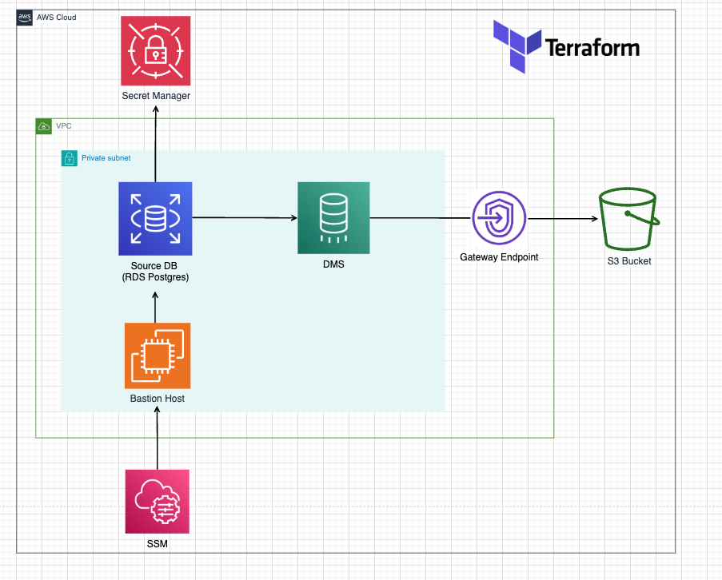

- Components:
	- Source Postgres DB (RDS) deployed in a private subnet
	- AWS DMS deployed in a private subnet
	- AWS DMS output data to target S3 bucket via gateway endpoint
	- Bastion host (EC2) in private subnet to connect to the private RDS
	- Secret Manager which stores the source DB secret (username & password)
	- AWS session manager (SSM) for me (SQL client) to access the private source DB
	
- Data Flow
```ruby
Source DB (Postgres) ───▶ AWS DMS ───▶ S3 datalake (parquet files)

loading mode: Full load (initial) + CDC (continuous replication)
```

---
## Pre-requisites

1. AWS CLI installed (IAM user able to connect to AWS with necessary permissions)
2. Terraform installed
3. Install SessionManagerPlugin to enable using  SSM from CLI
```ruby
brew install --cask session-manager-plugin
```

## Setup Steps

1. Deploy the infrastructure using terraform
```ruby
cd terraform
terraform init
terraform apply
```
- you will see the output like below when infra setup is completed.
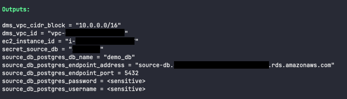
2. Start SSM session and do SSM port forwarding via AWS CLI
```ruby
aws ssm start-session \
  --target <ec2_instance_id> \
  --document-name AWS-StartPortForwardingSessionToRemoteHost \
  --parameters '{"host":["source-db.xxxxx.<aws_region_name>.rds.amazonaws.com],"portNumber":["5432"],"localPortNumber":["5432"]}'
```

3. Connect to RDS using local sql client 
```ruby
# Flow
my laptop → (secure tunnel) → EC2/SSM → RDS
```

- Setting in local SQL client:
```ruby
- Host: localhost
- Port: 5432
- DB: demo_db
- User: <user_name>
- Password: <password>
  
Note: remember to turn SSL on.
```
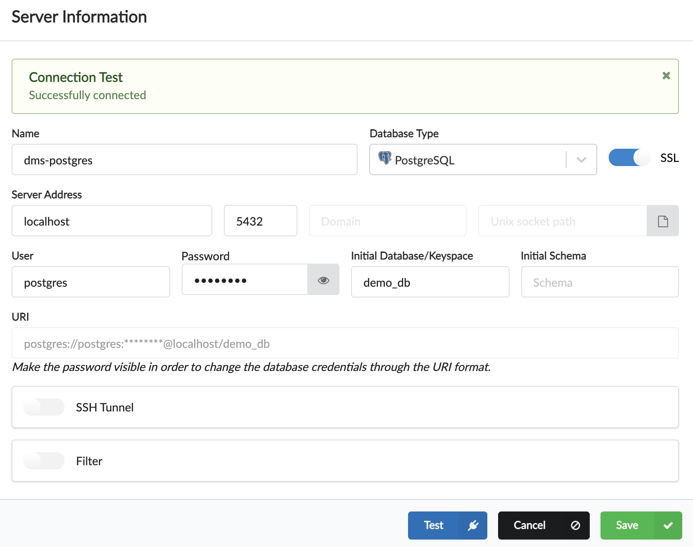

4. Create table and insert some data in source DB, you can reference [sql/0_full_load_test.sql](sql/0_full_load_test.sql) 
5. Go to AWS DMS console, **start** the replication task and perform an initial load (full load) of data.
   
- DMS dashboard
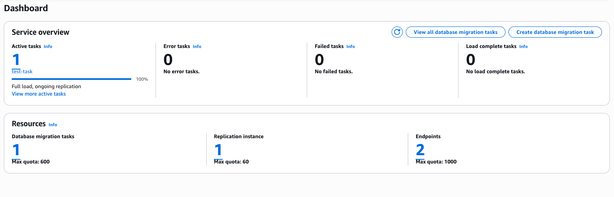

- DMS endpoints
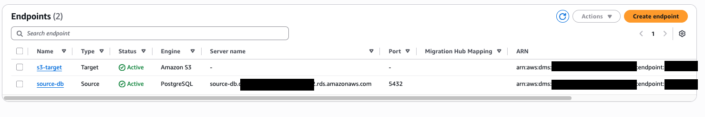

- DMS replication instance
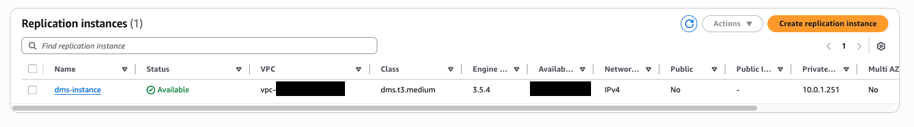

- DMS task: Click Actions -> Start
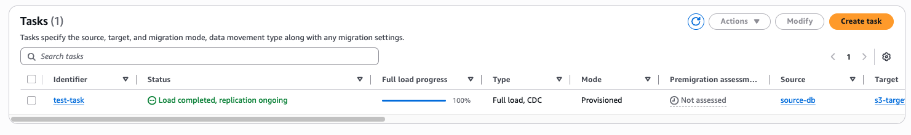

- Check the CloudWatach logs
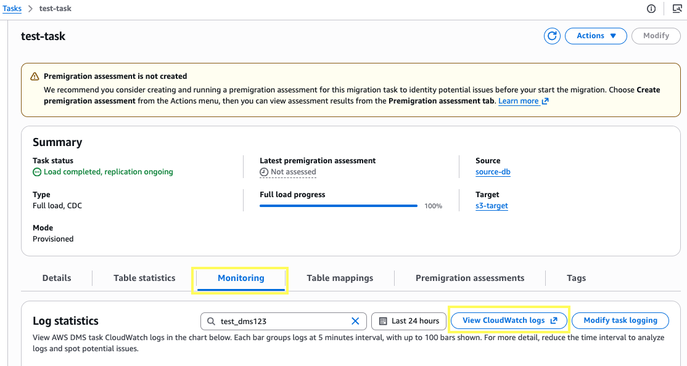

- view the logs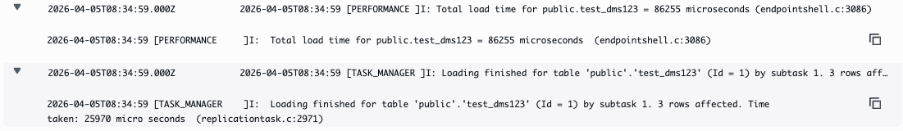

6. Go to S3 and check if the data is successfully replicated.
```ruby
s3://<dms_output_bucket>/public/test_dms123/
```

## Test CDC flow

- To test CDC flow, we perform DML queries in source DB (insert/update/delete). The DMS task continuously reads changes from the source database transaction logs (e.g., WAL in PostgreSQL) and replicates them to S3. We can inspect the data in S3 accordingly.
	- Example DML query: [sql/1_cdc_test.sql](sql/1_cdc_test.sql) 
	- Check the result data in S3.
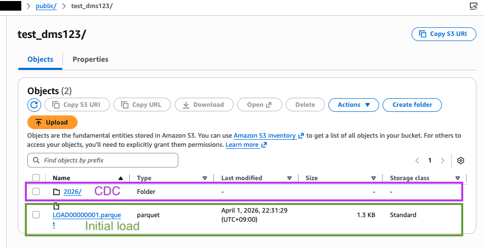

**Small files problem**
- Each CDC event is written as a separate file with a replication timestamp, potentially creating many small files, which can impact downstream processing performance and may require compaction strategies.
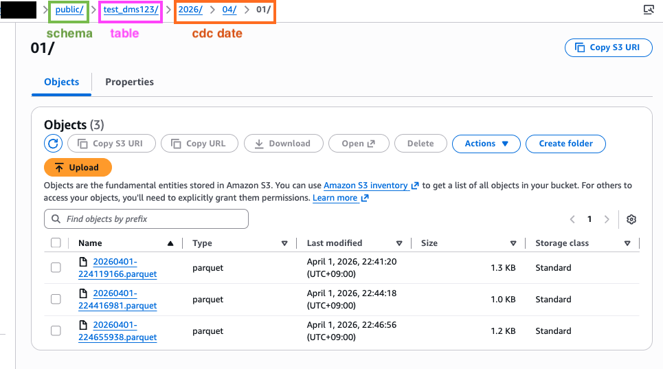

## Key Observations

- DMS outputs CDC data as **append-only** records when using S3 target  
- Each change is represented using operation codes (I/U/D)  
- No automatic merge or upsert is performed  
- Multiple changes for the same primary key appear as separate rows
- Extra columns added by DMS: `Op, dms_ts`
```python
import awswrangler as wr

df = wr.s3.read_parquet(path="s3://<dms_output_bucket>/public/test_dms123/")
df.sort_values(ascending=True, by = ['dms_ts'])
```
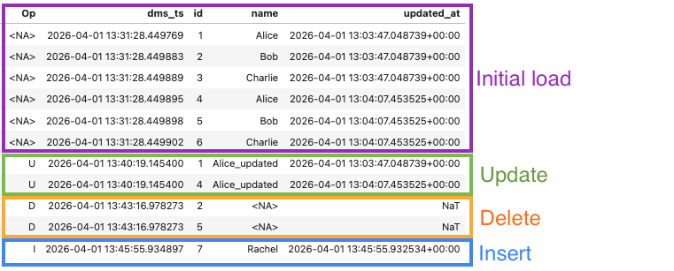

- To reconstruct the latest table state, a downstream process is required for the merge logic.
	- order events correctly (based on timestamp / log position)
	- apply INSERT / UPDATE / DELETE semantics
	- handle duplicates and late-arriving events

---
## Clean up

**option 1: destroy all resources**
1. go to the s3 bucket and manually delete all objects inside
2. terraform destroy
```ruby
terraform destroy
```

**option 2: destroy all resources except for the s3 bucket**
```ruby
terraform state rm aws_s3_bucket.dms
terraform destroy
```

---
## So, DMS or Airbyte for CDC pipeline?

It depends on whether you want a tool that only moves data, or one that also manages how the data is stored and updated. Let’s compare them.
### Using AWS Database Migration Service

DMS is extremely simple to set up as a fully managed AWS service. We only need to configure:
- source and target endpoints
- replication instance
- task configuration (full load + CDC)

Once configured, DMS reliably streams data into S3 with minimal operational overhead.

However, the output is still **raw CDC data**. When using S3 as the target:
- data is **append-only**
- changes are represented as **event records (I/U/D flags)**

This means **downstream processing** is required to:
- replay CDC events
- reconstruct the latest table state
- handle deduplication and ordering

> Note: When using AWS DMS with database targets (e.g., RDS), CDC changes can be applied directly as inserts, updates, and deletes.  The append-only behavior discussed here specifically applies when using S3 as the target.

### Using Airbyte

While self-hosting Airbyte can introduce operational complexity (e.g., Kubernetes/EKS setup, scaling, resource tuning), it provides a much more complete CDC solution out of the box.

With native Iceberg support (when using an Iceberg-compatible destination):
- CDC events are automatically **merged into final table state**
- data is stored in **Iceberg format with ACID guarantees**
- no additional transformation layer is required for upserts

This means users can:
- query the latest state directly
- leverage **time travel and snapshotting**
- avoid building custom CDC merge pipelines

### Key Difference

The fundamental difference is:
- DMS → **data movement layer (raw CDC events)**
- Airbyte → **data movement + table abstraction layer (e.g., Iceberg with built-in CDC merge)**

### Trade-off

| Aspect               | DMS                                      | Airbyte                          |
| -------------------- | ---------------------------------------- | -------------------------------- |
| Setup complexity     | Low                                      | Medium–High                      |
| Operational overhead | Low                                      | Medium                           |
| Output format        | Raw CDC files (e.g. Parquet on S3)       | Iceberg tables                   |
| CDC handling         | Manual (requires downstream merge logic) | Automatic                        |
| Iceberg support      | No (requires downstream processing)      | Yes (native support)             |
| S3 data behavior     | Append-only (when using S3 as target)    | CDC merged into Iceberg table    |
| Best use case        | Data ingestion / migration pipelines     | End-to-end CDC → analytics table |

## Conclusion

In this exercise, I demonstrated how to use AWS Database Migration Service to replicate data from a PostgreSQL source into Amazon S3 with continuous CDC ingestion.

While DMS provides a robust and low-maintenance way to capture and store change data, it requires additional downstream processing to convert raw CDC events into a usable analytical table format when using S3 as the target endpoint.

For use cases that prefer minimal pipeline engineering and an Iceberg-based lakehouse architecture on top of an S3 data lake, Airbyte provides a more complete, out-of-the-box solution.

On the other hand, DMS is a strong choice when you need a simple, reliable ingestion layer and want full control over downstream processing and data modeling.

In short, DMS provides flexible building blocks, while Airbyte offers a more complete, ready-to-use pipeline.

## Future Improvements

- Build a downstream CDC merge pipeline using dbt or Apache Spark  
- Convert raw CDC data into Iceberg / Hudi tables  
- Implement data validation between source and S3

---
## References

- AWS Terraform script sample for deploying DMS: 
  https://github.com/aws-samples/aws-dms-terraform

- Terraform doc for DMS: 
  https://registry.terraform.io/providers/-/aws/latest/docs/resources/dms_s3_endpoint

- Medium article on DMS: 
  https://medium.com/@alxsbn/mysql-to-s3-with-aws-dms-what-actually-works-in-production-96cd06f39301

- DMS tasks: 
  https://docs.aws.amazon.com/dms/latest/userguide/CHAP_Task.CDC.html

- SSM connect to private instance: 
  https://medium.com/@dipandergoyal/aws-ssm-connect-private-rds-instance-from-personal-computer-4a8e0c118094

- Apply record level changes from relational databases to Amazon S3 data lake using Apache Hudi on Amazon EMR and AWS Database Migration Service: 
  https://aws.amazon.com/blogs/big-data/apply-record-level-changes-from-relational-databases-to-amazon-s3-data-lake-using-apache-hudi-on-amazon-emr-and-aws-database-migration-service/